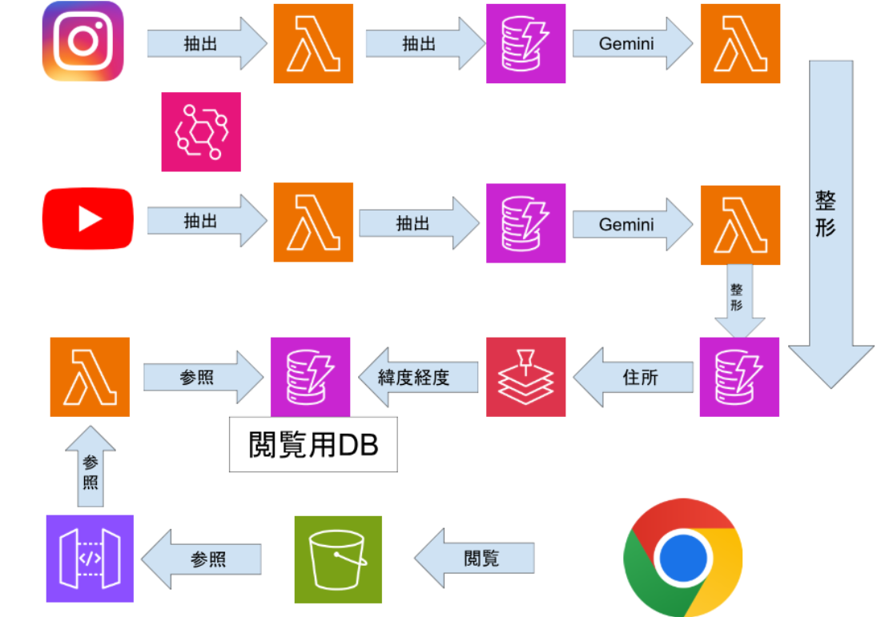

# SNS_buzz_map-with-AWS
My classmates and I developed an SNS-based restaurant discovery web application as part of an AWS assignment.
This application displays restaurants that are both located near the user’s current location and trending (“buzzing”) on social networking services (SNS).  
The overall system architecture is illustrated in the AWS architecture diagram.

  

## System Overview
The system consists of the following four main components:
### 1. Collecting trending SNS posts and calculating a buzz score  
Data such as post titles and numbers of likes are collected from multiple SNS platforms via their APIs.  
An AWS Lambda function stores this data in DynamoDB and calculates an original evaluation metric (buzz score).  
These batch processes are executed automatically in the morning, afternoon, and evening using Amazon EventBridge.
### 2. Extracting restaurant information using AI and structuring the database  
From complex textual data such as post titles and descriptions, restaurant names and addresses are extracted using Gemini (AI).  
The processed data is then stored in a newly structured DynamoDB table.
### 3. Converting addresses into geographic coordinates  
To enable map visualization, Amazon Location Service is used to convert restaurant addresses into latitude and longitude coordinates.  
The converted data is saved as the finalized dataset in the database.
### 4. Web-based map visualization and user interaction  
Restaurant data is retrieved from DynamoDB via API Gateway and Lambda.  
The user’s current location is obtained using browser-provided APIs, and the web application is hosted on Amazon S3.  
The system supports features such as restaurant search, visit history tracking, and a user-friendly interface for better usability.

## Example UI

  

  

